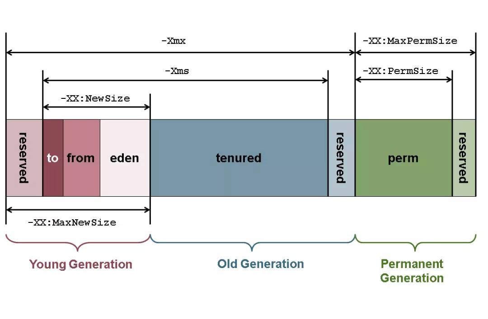

# JVM概念
## 

# 类加载

# 运行时

# 执行引擎

# 垃圾回收
## 垃圾回收的概念
垃圾回收是一种自动进行内存管理的方案，区别与手动进行内存管理。优点是：1降低开发者代码成本；2.保证程序正确性，减少人为产生的内存泄漏等问题。

## 常见垃圾回收算法
1. 标记清除
2. 标记整理(压缩)
3. 复制
4. 分代

## 垃圾回收的衡量标准
1. 吞吐量
2. 停顿时间

## 分代收集
### 分代结构

1. 新生代：伊甸区、幸存区(2个一样大的区域from和to)
2. 老生代：老年代
3. 永久代：永久代

### 分代流程

## CMS详解
[CMS垃圾处理器](https://juejin.cn/post/7023935314703941663)
### CMS的理解
概念：并发标记清除(Mostly Concurrent Mark and Sweep)。
作用范围：CMS是一种针对老年代进行垃圾回收的算法。
设计目标：避免在老年代垃圾收集时出现长时间的卡顿。
适用场景：GC过程短暂，低延迟，适合对延迟要求较高的系统。

### CMS的核心过程
1、初始标记（CMS initial mark）：会STW，核心是找到GC Roots
2、并发标记（CMS concurrent mark）：不会STW，从GC Roots采用三色标记法遍历所有的对象，标记存活的对象。
3、重新标记（CMS remark）：会STW，最终确定要清理的对象。
4、并发清除（CMS concurrent sweep）：不会STW，并发清理内存中的对象。

### CMS三色标记法

### 解决跨代引用和并发标记失效问题
通过Card(卡片)的方式将发生改变的老年代区域标记为“脏”区，这就是所谓的卡片标记（Card Marking）。
在并发标记阶段，还会加入并发预清理，针对：老年代中在并发标记中被标记为“dirty”的card以及幸存区（from和to）中引用的老年代对象进行标记

### CMS缺点
1. 吞吐量降低:对处理器资源敏感，执行垃圾收集时会占用一部分线程时程序吞吐量降低
2. 占用CPU资源，与CPU核数挂钩:开头说到了CMS默认启动的回收线程是（CPU核心数 +3）/4，当CPU核数越多，垃圾回收线程占用的资源就越少，反正CPU核数越少，占用资源就越多。
3. 内存碎片问题：CMS使用的是标记-清除算法，这种算法的弊端就是会产生内存碎片，导致大对象无法分配，就会触发Full GC
4. 无法处理“浮动垃圾”:在并发收集阶段时，当用户线程创建了一个对象年轻代放不下直接晋升到老年代或者年轻代对象晋升到老年代，因此CMS垃圾收集器必须要预留一部分空间给用户线程
    如果这个空间不足，可能导致Concurrent Mode Failure，会退化为Serial Old来进行老年代收集，导致停顿时间增加。
   
### CMS问题及调优
并发模式失败： CMS大部分阶段是与用户线程并发执行的，如果在执行垃圾收集时用户线程创建的对象直接往老年代分配，但是没有足够的内存，就会报Concurrent mode failure
晋升失败： 新生代做Minor GC的时候，老年代没有足够的空间用来存放晋升的对象，则会报Concurrent mode failure；如果由于内存碎片问题导致无法分配，就会报晋升失败
永久代空间（Java8的元空间）耗尽： 默认情况下CMS不会对永久代进行收集，一旦永久代空间耗尽，就会触发FullGC

## G1详解
[G1垃圾处理器](https://juejin.cn/post/7010034105165299725)

### G1概述
概念：Garbage-First是面向服务端应用的垃圾收集器
作用范围：新生代和老年代
设计目标：主要针对配备多核CPU及大容量内存的机器,以极高概率满足GC停顿时间的同时,还兼具高吞吐量的性能特征

### G1概述

## ZGC详解

# 应用实践

